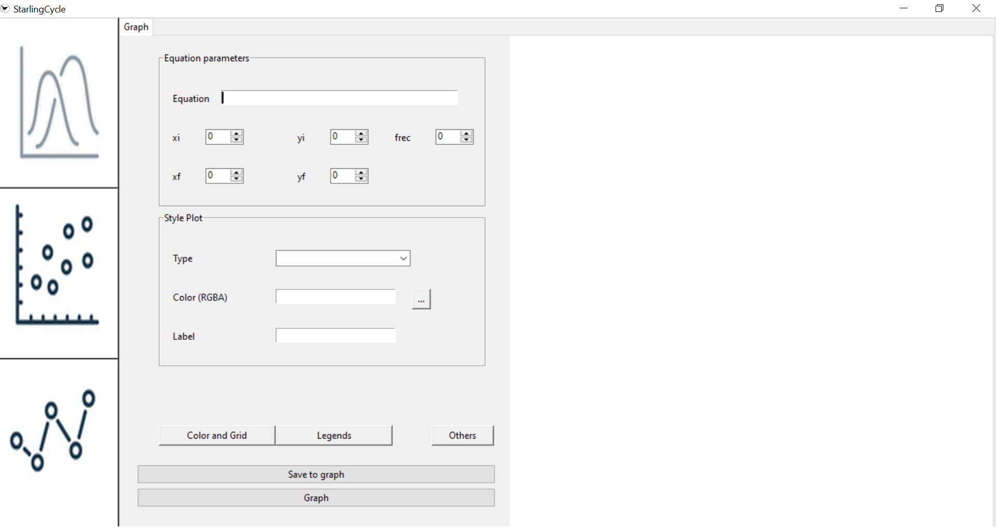
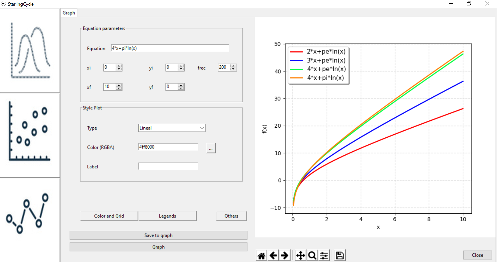
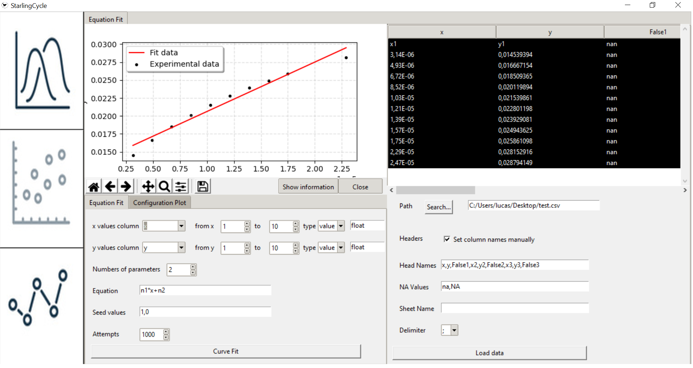

# StarlingCycle-GUI
GUI developed in python and Tkinter. Generate Graphics, fit data to functions and use machine learning algorithms

This is a GUI developed in python and Tkinter where you can plot any functions you want. This GUI counts with 3 main functionalities:
1. Plotter
2. Fit equation
3. Machine learning algorithm

# Requirements

- python 3.7 or later
- install numpy 
- install csv
- install pandas 
- install re 
- install matplotlib 

**To run the application, run the MainExe.py file in the console.**

# Plotter Instruction
To open the plotter main window press the first button on the button bar. It will show you the following work window

On the left side, you will find the fields to complete. The first entry  corresponds to the equation you want to plot.
Remember the following rules when you introduce an equation:
1. Always use x as variable
2. If there is an exponential, sin or cos, please always write the argument of the function between parenthesis, no matter its complexity. For example: e^(x) or sin(2x+5)
3. Please check how to write the different mathematical expressions in the next table.

| Expression | Meaning |
| ------------- | ------------- |
| e^() | Exponential |
| x^() or x**()  | Exponent |
| sqt()  | Square root |
| ln  | Natural logarithm |
| log2  | Binary logarithm |
| log10  | Decimal logarithm |
| sin  | Sine |
| cos  | Cosine |
| tan  | Tangent |
| pi  | Pi number |
| pe  | Euler's number |

The xi, xf, yi, yf fields allow you to set the extreme values of the axes of your plot. If you don't complete them, the default values will be from 0 to 100. if yi is equal to yf, the y-axis scale will be adjusted automatically. The frec field represents the number of samples to generate in the range [xi,xf]. The default value will be 100. 

In the "Style Plot" label frame you can configure the style plot (scatter or lineal), the color line and the name of the function. The default style plot is lineal and the default label is the equation. The color line doesn't have a default value, it will take a random color if you don't define it.
Using the button "save", you can save any functions you want and then plot them all together in a single graph using the "graph" button. The following picture shows you an example.

If you want to delete the saved functions press the button close. This one will delete all the functions and equations that have been saved.
The buttons "color and grid" and "legend" allow you to set up the configuration related to the grid, background and labels. When you set a style, you will set it for all your saved functions.

# Fit equation instruction

The first step is to load the csv or xlsx file with the experimental data. Before loading, you can configure the names of the columns, the NA values ​​and the name of the spreadsheet to be read. To set the NA values ​​and the column names, you must write them separated by commas. If the program finds a NA value, it will remove the entire row. If you do not want to analyze the values of one particular column, you can name it as False\d (ex: False1, False2). You cannot name two columns with the same name.
The data inside the file will be displayed in a top panel and also a configuration panel will be generated, where you can set up the fit parameters. The equation field follows the same instructions as the Plotter. The adjustment variables can be written as nx inside the equation(ex. n1, n2, n3). The Seed values ​​must be  introduced separated by commas. If you add less seed values than variables, the rest of the variables will take 1 as seed value. 
The range of x and y must be equal in size. There are two types of data allowed: "values" ​​or "datetime". If ‘values' ​​is taken, the column can be set to "int" or "float" by typing int or float. if "datetime" is taken, you can type the format you want in the empty field next to this one (see datetime formats in https://docs.python.org/3/library/datetime.html).

# Machine learning algorithm

It is still in development.

